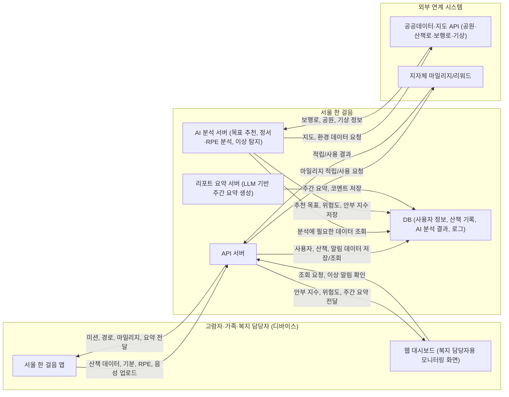

# SeoulOneStep
## Architecture

```mermaid
graph LR
    subgraph User["고령자·가족·복지 담당자 (디바이스)"]
        App["서울 한 걸음 앱"]
        Dash["웹 대시보드 (복지 담당자용 모니터링 화면)"]
    end

    subgraph Service["서울 한 걸음"]
        API["API 서버"]
        AI["AI 분석 서버 (목표 추천, 정서·RPE 분석, 이상 탐지)"]
        LLM["리포트 요약 서버 (LLM 기반 주간 요약 생성)"]
        DataStore["DB (사용자 정보, 산책 기록, AI 분석 결과, 로그)"]
    end

    subgraph Ext["외부 연계 시스템"]
        PublicAPI["공공데이터·지도 API (공원·산책로·보행로·기상)"]
        Reward["지자체 마일리지/리워드"]
    end

    App -->|"산책 데이터, 기분, RPE, 음성 업로드"| API
    Dash -->|"조회 요청, 이상 알림 확인"| API

    API -->|"미션, 경로, 마일리지, 요약 전달"| App
    API -->|"안부 지수, 위험도, 주간 요약 전달"| Dash

    API -->|"사용자, 산책, 알림 데이터 저장/조회"| DataStore
    AI -->|"분석에 필요한 데이터 조회"| DataStore
    AI -->|"추천 목표, 위험도, 안부 지수 저장"| DataStore
    LLM -->|"주간 요약, 코멘트 저장"| DataStore

    AI -->|"지도, 환경 데이터 요청"| PublicAPI
    PublicAPI -->|"보행로, 공원, 기상 정보"| AI

    API -->|"마일리지 적립/사용 요청"| Reward
    Reward -->|"적립/사용 결과"| API
```
