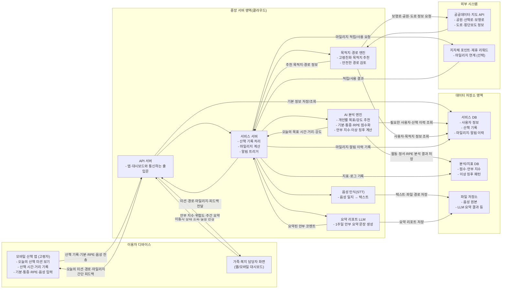

# SeoulOneStep
## Architecture

```mermaid
flowchart LR
    %% 레벨: 디바이스 – 서버 – DB 관계가 한눈에 보이도록

    %% 1. 이용자 디바이스
    subgraph Devices["이용자 디바이스"]
        App["모바일 산책 앱 (고령자)\n- 오늘의 산책 미션 보기\n- 산책 시간·거리 기록\n- 기분·통증·RPE·음성 입력"]
        Care["가족·복지 담당자 화면\n(웹/모바일 대시보드)"]
    end

    %% 2. 중앙 서버(서비스·AI)
    subgraph Servers["중앙 서버 영역(클라우드)"]
        APIServer["API 서버\n- 앱·대시보드와 통신하는 출입문"]
        ServiceCore["서비스 서버\n- 산책 기록 처리\n- 마일리지 계산\n- 알림 트리거"]
        AIEngine["AI 분석 엔진\n- 개인별 목표/강도 추천\n- 기분·통증·RPE 점수화\n- 안부 지수·이상 징후 계산"]
        RouteEngine["목적지·경로 엔진\n- 고령친화 목적지 추천\n- 안전한 경로 검토"]
        STT["음성 인식(STT)\n- 음성 일지 → 텍스트"]
        LLMReport["요약 리포트 LLM\n- 1주일 안부 요약 문장 생성"]
    end

    %% 3. 데이터베이스·저장소
    subgraph DBs["데이터 저장소 영역"]
        MainDB["서비스 DB\n- 사용자 정보\n- 산책 기록\n- 마일리지·알림 이력"]
        LogDB["분석/지표 DB\n- 점수·안부 지수\n- 이상 징후 패턴"]
        FileStore["파일 저장소\n- 음성 원본\n- LLM 요약 결과 등"]
    end

    %% 4. 외부 시스템
    subgraph External["외부 시스템"]
        PublicData["공공데이터·지도 API\n- 공원·산책로·보행로\n- 도로·횡단보도 정보"]
        Reward["지자체 포인트·제휴 리워드\n- 마일리지 연계 (선택)"]
    end

    %% ───── 디바이스 → 서버 ─────
    App -->|"산책 기록·기분·RPE·음성 전송"| APIServer
    Care -->|"이용자 상태 조회·설정 변경"| APIServer

    %% ───── 서버 내부 흐름 ─────
    APIServer --> ServiceCore

    ServiceCore --> AIEngine
    ServiceCore --> RouteEngine
    ServiceCore --> STT
    ServiceCore --> LLMReport

    %% ───── 서버 ↔ DB 관계 ─────
    APIServer -->|"기본 정보 저장/조회"| MainDB

    AIEngine -->|"활동·정서·RPE 분석 결과 저장"| LogDB
    AIEngine -->|"필요한 사용자·산책 이력 조회"| MainDB

    RouteEngine -->|"사용자·목적지 정보 조회"| MainDB

    STT -->|"텍스트·파일 경로 저장"| FileStore
    LLMReport -->|"요약 리포트 저장"| FileStore

    ServiceCore -->|"마일리지·알림 이력 기록"| MainDB
    ServiceCore -->|"지표·로그 기록"| LogDB

    %% ───── 서버 ↔ 외부 시스템 ─────
    RouteEngine -->|"보행로·공원·도로 정보 요청"| PublicData
    PublicData --> RouteEngine

    ServiceCore -->|"마일리지 적립/사용 요청"| Reward
    Reward -->|"적립/사용 결과"| ServiceCore

    %% ───── 서버 → 디바이스(응답) ─────
    AIEngine -->|"오늘의 목표 시간·거리·강도"| ServiceCore
    RouteEngine -->|"추천 목적지·경로 정보"| ServiceCore
    LLMReport -->|"요약된 안부 코멘트"| ServiceCore

    ServiceCore -->|"미션·경로·마일리지·피드백 전달"| APIServer
    APIServer -->|"오늘의 미션·경로·마일리지\n간단 피드백"| App
    APIServer -->|"안부 지수·위험도·주간 요약"| Care
```
